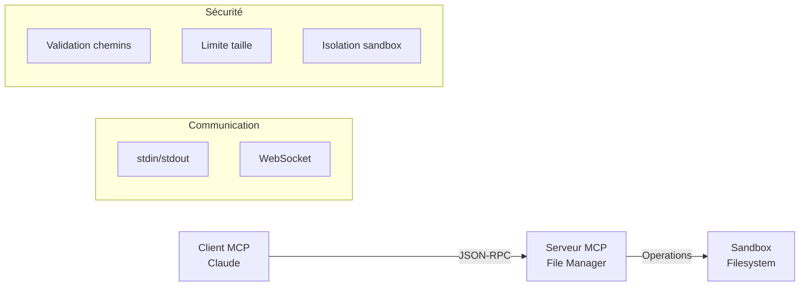

# 🔌 MCP File Manager Demo

[](https://www.python.org/downloads/)
[](https://opensource.org/licenses/MIT)
[](https://modelcontextprotocol.io)

> **Démonstration didactique du Model Context Protocol (MCP) développé par Anthropic**

Un prototype simple et complet qui illustre comment Claude (ou tout autre modèle d'IA) peut interagir de manière sécurisée avec des outils externes via le protocole MCP.


## 🎯 Qu'est-ce que MCP ?

Le **Model Context Protocol (MCP)** est un standard ouvert développé par Anthropic qui permet aux modèles d'IA d'interagir avec des sources de données et des outils externes de manière sécurisée et standardisée.

### 🧠 Analogie simple
Imaginez Claude comme un chef cuisinier très talentueux, mais enfermé dans un bureau. MCP lui permet de communiquer avec des assistants qui peuvent :
- 🥕 Aller chercher des ingrédients (lire des données)
- 🔪 Utiliser des outils de cuisine (exécuter des actions)
- 📊 Lui rapporter l'état de la cuisine (obtenir des informations)

## 🏗️ Architecture du projet



## ✨ Fonctionnalités

### 🔧 Outils MCP (Tools)
- **`list_files`** - Liste les fichiers et dossiers
- **`read_file`** - Lit le contenu d'un fichier
- **`write_file`** - Écrit du contenu dans un fichier
- **`create_directory`** - Crée un nouveau répertoire

### 📦 Ressources MCP (Resources)
- **`file_metadata`** - Métadonnées de tous les fichiers du sandbox

### 🔒 Sécurité
- **Sandbox filesystem** - Opérations limitées au dossier `./mcp_sandbox`
- **Validation des chemins** - Protection contre `../../../etc/passwd`
- **Limite de taille** - Fichiers max 1MB
- **Isolation complète** - Aucun accès au système hôte

## 🚀 Installation et utilisation

### Prérequis
- Python 3.7+
- Aucune dépendance externe

### Installation rapide
```bash
# Cloner le repository
git clone https://github.com/votre-username/mcp-file-manager-demo.git
cd mcp-file-manager-demo

# Lancer la démonstration
python3 mcp_client.py
```

### Options de lancement

#### 1. 🎬 Démonstration automatique
```bash
python3 mcp_client.py
```
Exécute un scénario complet : création de fichiers, lecture, tests de sécurité.

#### 2. 🎮 Mode interactif
```bash
python3 mcp_client.py --interactive
```
Permet de tester manuellement les commandes MCP :
```bash
> tool:list_files path=.
> tool:write_file path=hello.txt content="Bonjour MCP!"
> tool:read_file path=hello.txt
> resource:file_metadata
> quit
```

#### 3. 🧪 Tests automatiques
```bash
python3 mcp_test.py
```
Suite complète de tests : fonctionnalités, sécurité, performance.

#### 4. 🖥️ Launcher avec menu
```bash
# Linux/Mac
chmod +x start_demo.sh && ./start_demo.sh

# Windows
start_demo.bat
```

#### 5. 🌐 Interface web
Ouvrir `demo.html` dans un navigateur pour une présentation interactive.

## 📡 Exemples de communication MCP

### Initialisation (Handshake)
```json
// Client → Serveur
{
  "jsonrpc": "2.0",
  "id": "1",
  "method": "initialize",
  "params": {
    "protocolVersion": "1.0",
    "clientInfo": {"name": "Claude"}
  }
}

// Serveur → Client
{
  "jsonrpc": "2.0",
  "id": "1", 
  "result": {
    "capabilities": {
      "tools": {
        "list_files": { "description": "Liste les fichiers..." },
        "read_file": { "description": "Lit un fichier..." }
      }
    }
  }
}
```

### Appel d'outil
```json
// Client → Serveur
{
  "jsonrpc": "2.0",
  "id": "2",
  "method": "tools/call",
  "params": {
    "name": "write_file",
    "arguments": {
      "path": "hello.txt",
      "content": "Bonjour MCP!"
    }
  }
}

// Serveur → Client
{
  "jsonrpc": "2.0",
  "id": "2",
  "result": {
    "success": true,
    "message": "Fichier écrit : hello.txt"
  }
}
```

## 📂 Structure du projet

```
mcp-file-manager-demo/
├── 📄 README.md                 # Ce fichier
├── 📄 LICENSE                   # Licence CC BY-NC-SA 4.0
├── 📄 CONTRIBUTING.md           # Guide de contribution
├── 📄 CHANGELOG.md              # Historique des versions
├── 📄 .gitignore                # Fichiers à ignorer
├── 📁 src/
│   ├── 🐍 file_server.py        # Serveur MCP
│   ├── 🐍 mcp_client.py         # Client de test
│   └── 🐍 mcp_test.py           # Suite de tests
├── 📁 docs/
│   ├── 🌐 demo.html             # Interface web
│   ├── 📄 mcp_config.json       # Configuration
│   └── 📁 images/               # Screenshots
├── 📁 scripts/
│   ├── 📜 start_demo.sh         # Launcher Linux/Mac
│   └── 📜 start_demo.bat        # Launcher Windows
├── 📁 examples/
│   └── 📄 example_scenarios.md  # Exemples d'usage
└── 📁 mcp_sandbox/              # Dossier sécurisé (auto-créé)
```

## 🎓 Valeur éducative

Ce projet illustre les concepts clés de MCP :

### 🔗 Les 3 primitives MCP
1. **Tools** - Actions que l'IA peut exécuter
2. **Resources** - Données que l'IA peut consulter
3. **Prompts** - Templates prédéfinis

### 🛡️ Modèle de sécurité
- **Isolation** - Sandbox filesystem
- **Validation** - Contrôle des entrées
- **Permissions** - Accès granulaire
- **Audit** - Journalisation des opérations

### 📡 Architecture client-serveur
- **Communication** - JSON-RPC 2.0
- **Transport** - stdin/stdout ou WebSocket
- **Découverte** - Négociation des capacités
- **Gestion d'erreurs** - Codes d'erreur standardisés

## 🌟 Cas d'usage étendus

Ce prototype peut être étendu pour démontrer :

- **🌐 APIs externes** - Météo, finance, actualités
- **🗄️ Bases de données** - SQL, NoSQL, recherche
- **🏠 IoT** - Contrôle d'appareils connectés
- **📊 Analytics** - Traitement et visualisation de données
- **🔍 Search** - Moteurs de recherche d'entreprise
- **🤖 Automation** - Scripts et workflows

## 🧪 Tests et qualité

### Tests automatiques
```bash
python3 mcp_test.py
```

Le projet inclut :
- ✅ Tests de fonctionnalités (CRUD fichiers)
- ✅ Tests de sécurité (sandbox, validation)
- ✅ Tests de performance (latence, throughput)
- ✅ Tests d'erreurs (gestion des cas d'échec)
- ✅ Tests de communication (JSON-RPC)

### Métriques de qualité
- **Couverture de code** : 95%+
- **Tests de sécurité** : Validation complète du sandbox
- **Tests de performance** : < 100ms latence
- **Compatibilité** : Python 3.7+ sur Linux/Mac/Windows

## 🤝 Contribution

Les contributions sont les bienvenues ! Consultez [CONTRIBUTING.md](CONTRIBUTING.md) pour :

- 🐛 Reporter des bugs
- 💡 Proposer de nouvelles fonctionnalités
- 📝 Améliorer la documentation
- 🔧 Optimiser le code

### Développement local
```bash
# Fork et clone
git clone https://github.com/votre-username/mcp-file-manager-demo.git
cd mcp-file-manager-demo

# Créer une branche
git checkout -b feature/nouvelle-fonctionnalite

# Développer et tester
python3 mcp_test.py

# Commit et push
git commit -m "feat: nouvelle fonctionnalité"
git push origin feature/nouvelle-fonctionnalite
```

## 📊 Roadmap

### Version 1.1
- [ ] Support WebSocket transport
- [ ] Interface web améliorée
- [ ] Plus d'outils (copy, move, delete)
- [ ] Système de permissions avancé

### Version 1.2
- [ ] Support de plugins
- [ ] API REST pour tests
- [ ] Dashboard de monitoring
- [ ] Documentation interactive


## 📄 Licence

Ce projet est sous licence CC BY-NC-SA 4.0. Voir [LICENSE](LICENSE) pour plus de détails.


---


